# Arquitectura general — Librería POS

Documento de referencia de la arquitectura de la aplicación: capas, módulos, dependencias entre ellos, modelo de datos y los flujos principales. Los diagramas están en [Mermaid](https://mermaid.js.org/) y GitHub los renderiza directamente.

> Versión de referencia: baseline **v0.4.0**. Si cambia la estructura de `src/` o el esquema de la base de datos, actualiza este documento en el mismo PR.

## Índice

1. [Visión general](#1-visión-general)
2. [Contexto del sistema](#2-contexto-del-sistema)
3. [Capas](#3-capas)
4. [Módulos y dependencias](#4-módulos-y-dependencias)
5. [Catálogo de módulos](#5-catálogo-de-módulos)
6. [Modelo de datos](#6-modelo-de-datos)
7. [Flujos principales](#7-flujos-principales)
8. [Pruebas y pipeline](#8-pruebas-y-pipeline)
9. [Puntos de atención para QA](#9-puntos-de-atención-para-qa)

---

## 1. Visión general

**Librería POS** es una aplicación de escritorio **offline-first** de punto de venta e inventario para una librería en Guatemala.

| Aspecto | Decisión |
|---|---|
| Shell de escritorio | Tauri v2 (Rust). Sin comandos Rust propios, salvo `keyring_set/get/delete` para el token de Google |
| Frontend | React 18 + TypeScript + Vite, Tailwind, primitivas estilo shadcn/ui |
| Estado | Zustand (`settings` se serializa a mano en `localStorage`) |
| Persistencia | SQLite local (`libreria.db`) vía `@tauri-apps/plugin-sql` |
| Sincronización | Opcional: copia completa del `.db` en Google Drive, "la nube siempre gana" |
| Actualizaciones | `tauri-plugin-updater` contra GitHub Releases |
| Destino | Windows (desarrollo y pruebas en macOS/Linux) |

Principios:

- **Todo el SQL vive en `src/services/db.ts`.** Los componentes nunca arman consultas.
- **La lógica de negocio pura vive en `src/lib/`** (cálculos, stock, texto) y no depende de Tauri, así que se prueba directamente.
- **Los servicios envuelven las APIs de Tauri** (`plugin-sql`, `plugin-fs`, `plugin-http`, etc.), y en las pruebas se reemplazan con `vi.mock`.

---

## 2. Contexto del sistema

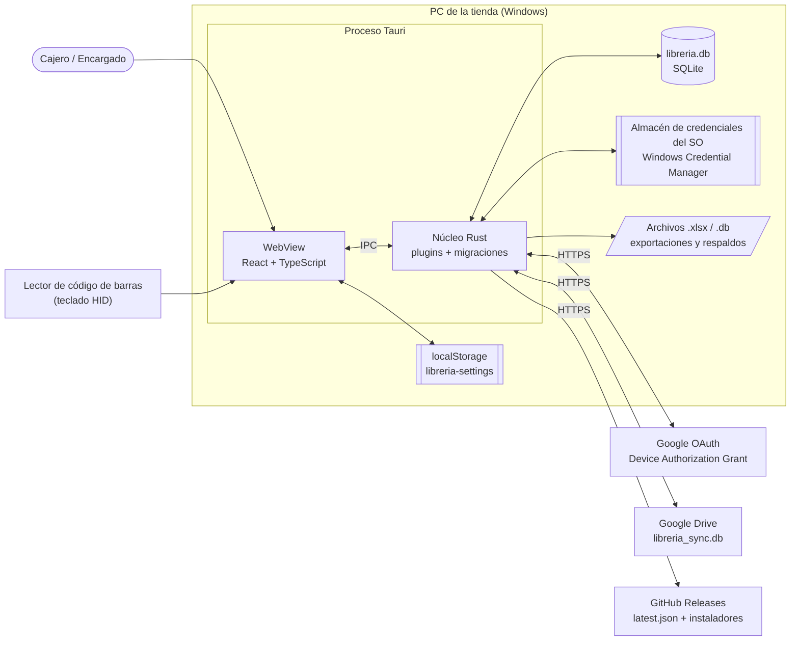

---

## 3. Capas

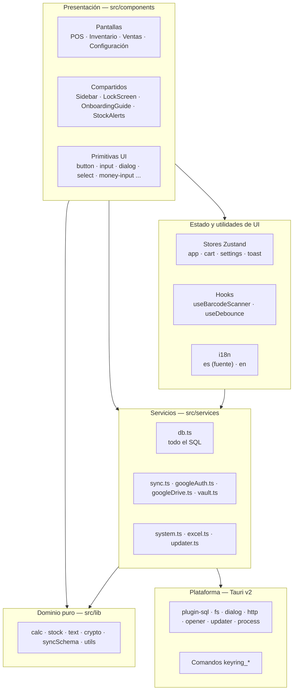

Regla de dependencia: las capas de arriba dependen de las de abajo. `src/lib` no importa Tauri (la única excepción es `syncSchema.ts`, que lee `app_meta` a través de `db.ts`).

---

## 4. Módulos y dependencias

### 4.1 Grafo de dependencias entre módulos

Generado a partir de los `import` reales del código (se omiten `components/ui`, `i18n`, `lib/utils` y `types`, que usan casi todos los módulos).

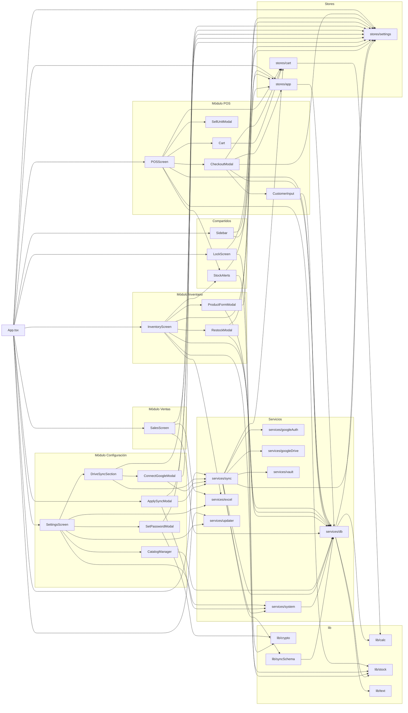

### 4.2 Dependencias hacia la plataforma (Tauri)

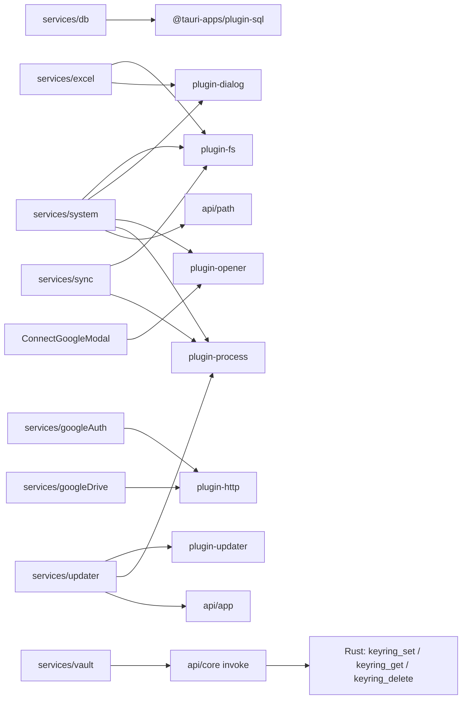

### 4.3 Observaciones del grafo

- **`services/db` es el punto central**: lo usan las cuatro pantallas, `stores/app`, `sync`, `system` y `syncSchema`. Cualquier cambio en `db.ts` tiene impacto amplio y está cubierto por `db.test.ts` con SQLite real (sql.js).
- **`db` depende de `stores/settings`** solo para `markDirty()`: cada escritura marca `syncPending = true` para que el siguiente tick de sincronización suba los cambios.
- **`sync` depende de `stores/cart`** para no interrumpir una venta en curso (si el carrito tiene artículos, no ofrece aplicar cambios remotos).
- **`i18n` depende de `stores/settings`** (idioma activo) y `stores/settings` depende de `i18n/translations` (tipo de idioma). Es un ciclo solo de tipos y valores por defecto, no de lógica.

---

## 5. Catálogo de módulos

### 5.1 Pantallas (presentación)

| Módulo | Archivos | Responsabilidad | Servicios que usa |
|---|---|---|---|
| **POS** | `components/pos/*` | Buscar productos (texto, categoría, código de barras), elegir unidad de venta, carrito, cobro, recibo | `db` (búsqueda, `completeSale`, clientes), `stores/cart` |
| **Inventario** | `components/inventory/*` | Alta/edición de productos y unidades de venta, reabastecimiento, ajuste de stock, exportar a Excel | `db`, `excel` |
| **Ventas** | `components/sales/SalesScreen.tsx` | Historial paginado, filtros por fecha, resumen y segmentos, detalle de venta, exportar | `db`, `excel` |
| **Configuración** | `components/settings/*` | Tienda, idioma, tema, moneda, métodos de pago, PIN, catálogos (categorías/clientes), respaldo/restauración, Google Drive, actualizaciones | `system`, `excel`, `updater`, `sync`, `db` |
| **Compartidos** | `components/shared/*` | Navegación (Sidebar), bloqueo por PIN, guía de primer uso, badges de alertas de stock | `stores/app`, `stores/settings`, `lib/crypto`, `lib/stock` |

### 5.2 Stores (`src/stores`)

| Store | Estado | Persistencia |
|---|---|---|
| `app` | Pantalla activa, sidebar colapsado, conteo de alertas de stock (`refreshStockAlerts`) | No |
| `cart` | Líneas de la venta en curso; fusiona producto + unidad repetidos | No |
| `settings` | Idioma, tema, moneda, tienda, PIN (hash), métodos de pago, onboarding, metadatos de Drive (`deviceId`, `driveFileId`, `syncPending`, último sync) | `localStorage` → `libreria-settings` |
| `toast` | Notificaciones efímeras | No |
| `useSyncUiStore` (en `services/sync.ts`) | Cambio remoto pendiente, bloqueo por esquema | No |

### 5.3 Servicios (`src/services`)

| Servicio | Responsabilidad |
|---|---|
| `db.ts` | Conexión memoizada (`getDb`), CRUD de productos, unidades, categorías, clientes; `completeSale`, `restockProduct`, `adjustStock`; consultas de ventas, resúmenes y movimientos |
| `sync.ts` | Orquesta Google Drive: conectar, adoptar remoto, subir inicial, `runSyncTick`, aplicar/posponer cambio remoto, loop cada 5 min |
| `googleAuth.ts` | OAuth Device Authorization Grant: código de dispositivo, polling, refresh de token |
| `googleDrive.ts` | Buscar, leer metadatos, subir y descargar `libreria_sync.db` (con `appProperties`) |
| `vault.ts` | Guarda/lee/borra el refresh token en el keyring del SO |
| `system.ts` | Ruta de la base, abrir carpeta de datos, respaldo y restauración del `.db` |
| `excel.ts` | Exportar inventario, ventas, movimientos y reporte general a `.xlsx` |
| `updater.ts` | Versión actual, buscar e instalar actualizaciones |

### 5.4 Dominio puro (`src/lib`)

| Módulo | Responsabilidad |
|---|---|
| `calc.ts` | Subtotales, total y ganancia del carrito, `stockDeducted = quantity_in_base_units × cantidad`, `stockAfter` |
| `stock.ts` | Clasificación única `ok / low / out` y conteos (`stockStatus`, `countStock`) |
| `text.ts` | Normalización de texto y búsqueda difusa (sin acentos, minúsculas) |
| `crypto.ts` | Hash y verificación del PIN |
| `syncSchema.ts` | `CURRENT_SCHEMA_VERSION` y lectura de `app_meta.schema_version` |
| `utils.ts` | `cn`, formato de moneda, stock y fechas |

---

## 6. Modelo de datos

Esquema vigente después de la migración v6 (definido en `src-tauri/src/lib.rs`). Todas las PK son UUID (`TEXT`) desde v5.

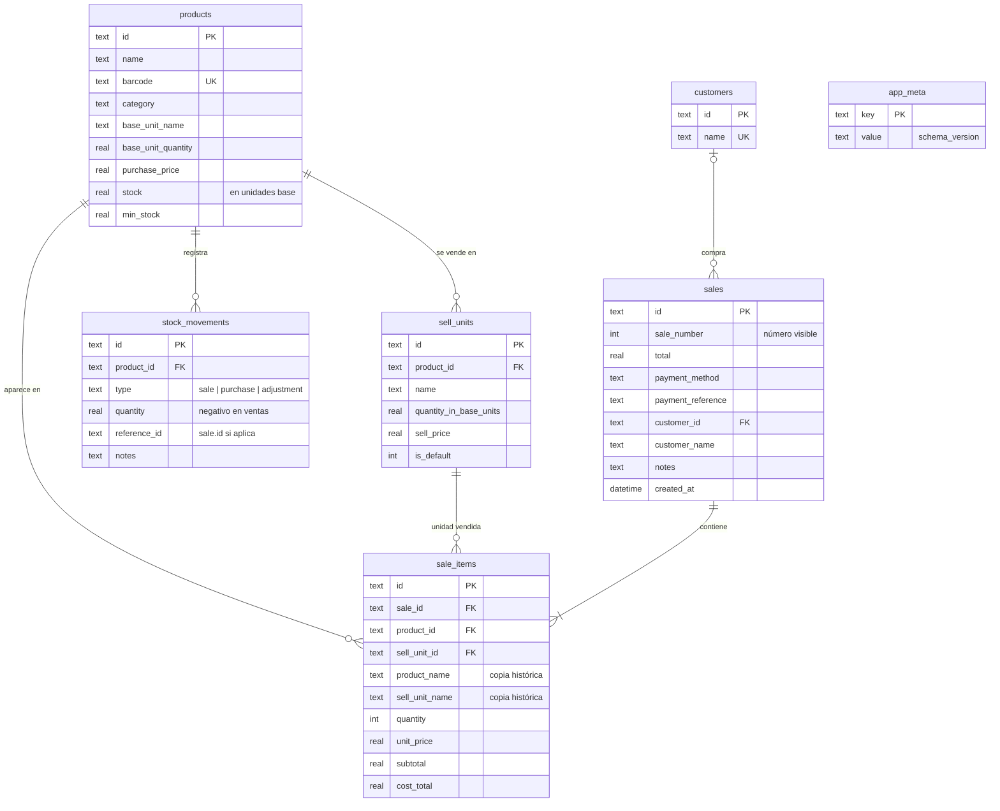

**Concepto clave — unidades de venta dinámicas:** el stock siempre se guarda en la unidad base (p. ej. resma). Cada `sell_unit` declara cuántas unidades base representa (hoja = 1/500, paquete de 4 = 4/500, resma = 1). Al vender se descuenta `quantity_in_base_units × cantidad`.

---

## 7. Flujos principales

### 7.1 Arranque de la aplicación

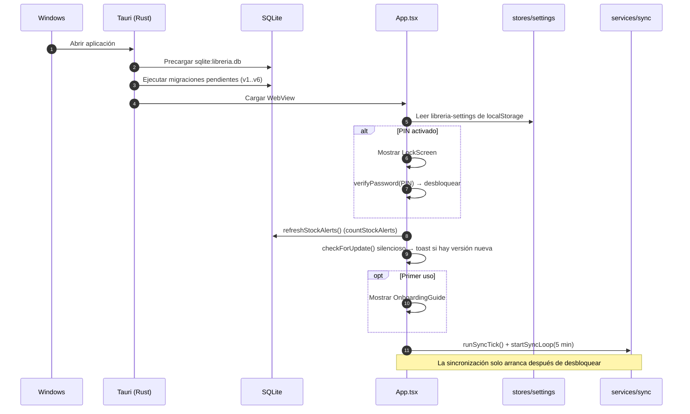

### 7.2 Registrar una venta (POS)

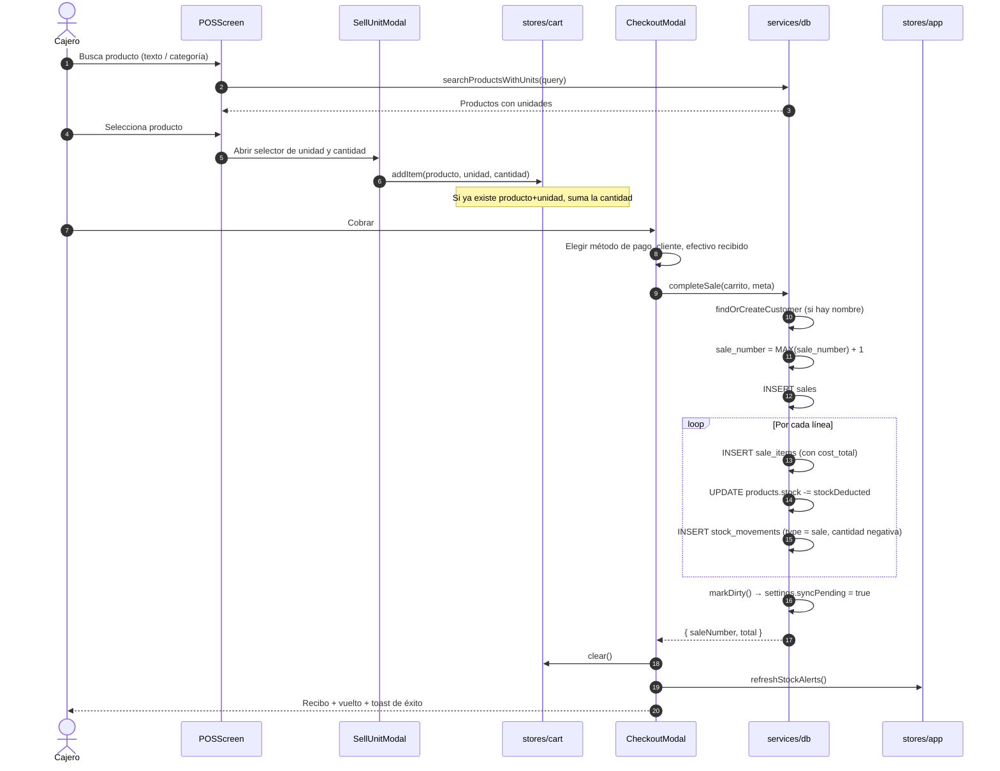

### 7.3 Escaneo de código de barras

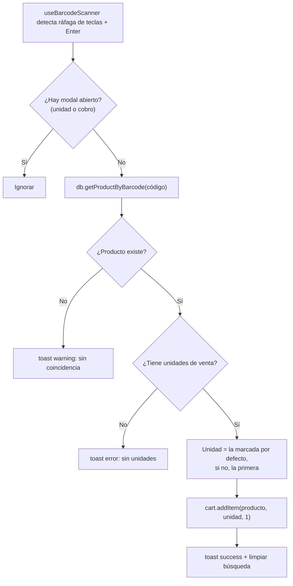

### 7.4 Inventario: reabastecer y ajustar stock

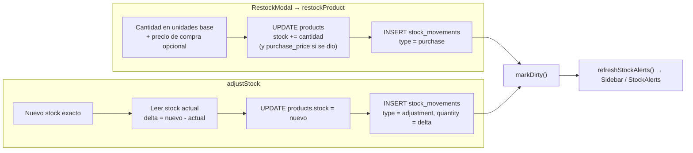

### 7.5 Clasificación de stock

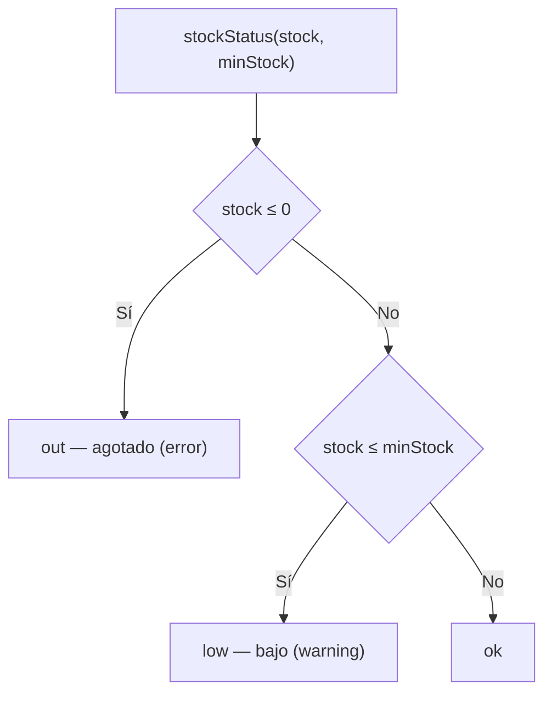

Fuente única: `src/lib/stock.ts`. POS, Inventario y Sidebar usan esta misma función.

### 7.6 Conectar Google Drive (primera vez)

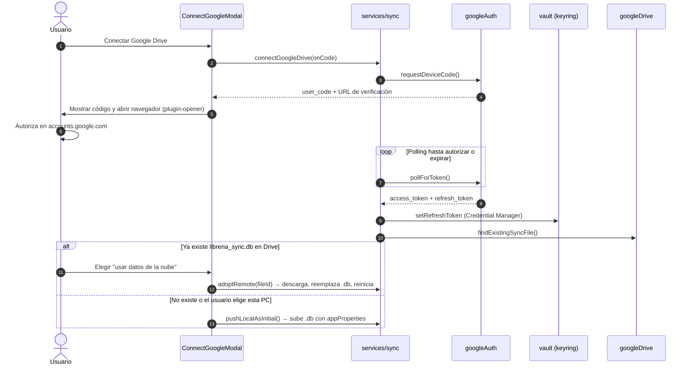

### 7.7 Ciclo de sincronización (`runSyncTick`)

Se ejecuta al desbloquear la app, cada 5 minutos y con el botón "Sincronizar ahora". Regla: **la nube siempre gana**, pero el cambio remoto nunca se aplica sin confirmación.

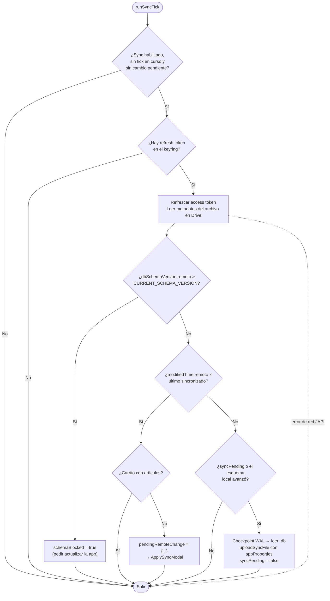

### 7.8 Aplicar un cambio remoto

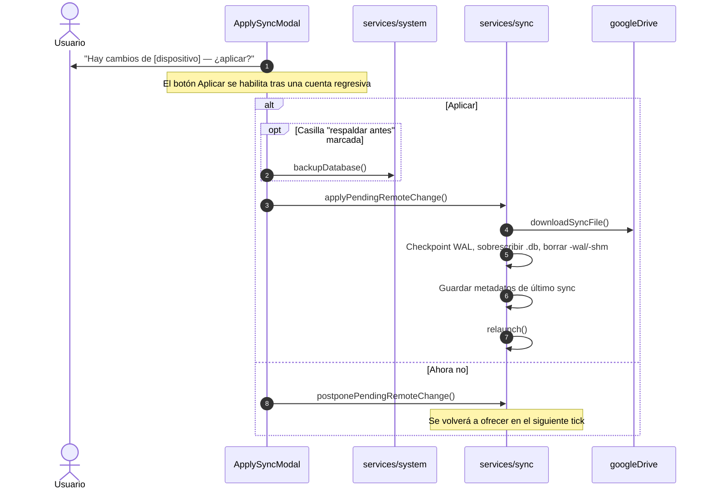

### 7.9 Respaldo y restauración manual

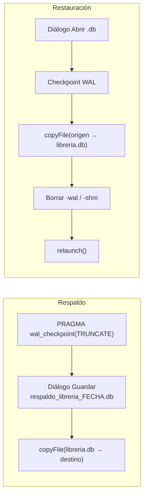

### 7.10 Actualización de la aplicación y release

```mermaid
flowchart LR
    pr["PR con título<br/>feat: / fix:"] --> ci["CI: typecheck + tests<br/>con cobertura<br/>(Ubuntu + Windows)"]
    ci --> merge["Merge a main"]
    merge --> ver["next-version.cjs<br/>calcula bump"]
    ver --> draft["Commit de versión +<br/>Release borrador"]
    draft --> pub["Publicar release"]
    pub --> build["Build firmado<br/>.msi / .exe"]
    build --> json["latest.json en<br/>GitHub Releases"]
    json --> app["App instalada:<br/>checkForUpdate() al iniciar"]
    app --> inst["Configuración → instalar<br/>→ relaunch"]
```

---

## 8. Pruebas y pipeline

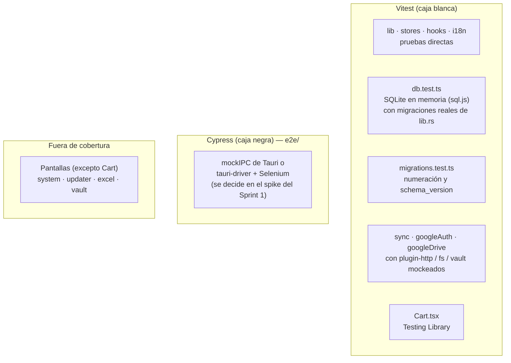

| Capa | Cómo se prueba |
|---|---|
| `src/lib`, `src/stores`, `src/hooks`, `src/i18n` | Unitarias directas |
| `src/services/db.ts` | `@tauri-apps/plugin-sql` reemplazado por sql.js con el esquema real |
| `src/services/sync.ts` y Google | Mocks de HTTP, FS, vault y cliente de Drive |
| Pantallas | E2E con Cypress (en construcción) |

---

## 9. Puntos de atención para QA

Características de la arquitectura que conviene cubrir con casos de prueba. No son bugs confirmados; si alguna prueba demuestra un fallo, se registra como `BUG-###` según la guía del equipo.

| Área | Característica | Qué probar |
|---|---|---|
| Venta | `completeSale` ejecuta varios `INSERT`/`UPDATE` secuenciales sin una transacción explícita | Comportamiento si ocurre un error a mitad de una venta con varias líneas |
| Venta | `sale_number` se calcula como `MAX + 1` | Numeración correlativa, también después de restaurar un respaldo o aplicar un sync |
| Stock | La venta descuenta stock sin validar existencia en `db.ts` | Vender más de lo disponible; cómo se ve el stock negativo en POS, Inventario y alertas |
| Unidades | `quantity_in_base_units` es `REAL` | Fracciones (hoja de una resma) y redondeo en stock y costo |
| Sync | La nube gana y reemplaza el `.db` completo | Ventas locales no subidas cuando llega un cambio remoto; confirmación y respaldo previo |
| Sync | Bloqueo por esquema | Archivo remoto con `dbSchemaVersion` mayor al soportado |
| Sync | No interrumpe ventas | Cambio remoto mientras hay artículos en el carrito |
| Seguridad | PIN en `localStorage` como hash; token de Google en el keyring | Que el token no aparezca en `localStorage` ni en archivos |
| Restauración | Reemplazo del `.db` + borrado de `-wal`/`-shm` + reinicio | Restaurar un respaldo con datos y verificar integridad |
| i18n | `en.ts` tipado contra `es.ts` | Textos sin traducir en pantallas nuevas (dashboard v0.5.0) |
